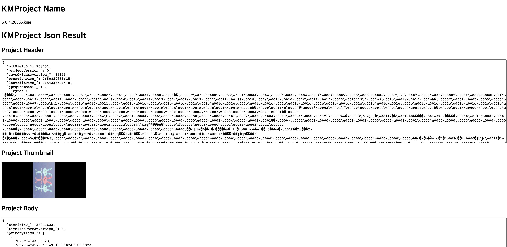

# KMProject Reader WEB 

## ScreenShot

## How to use ?
1. click this [web page link](http://0.0.0.0:8080)
2. select `xxx.kine` file or `xxx.kmproject` file and submit
3. `xxx.kine.txt` file will be downloaded
